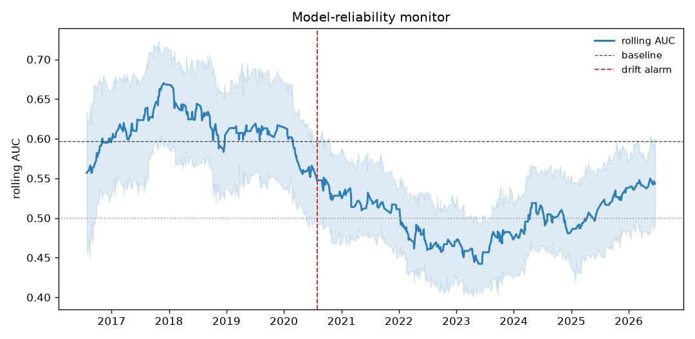
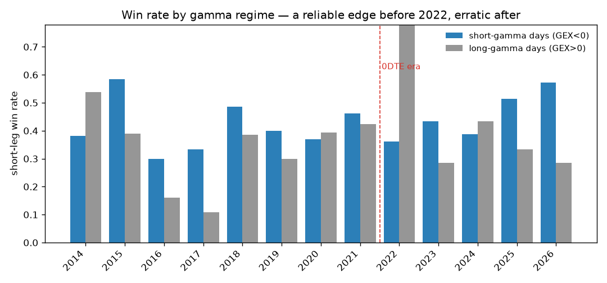
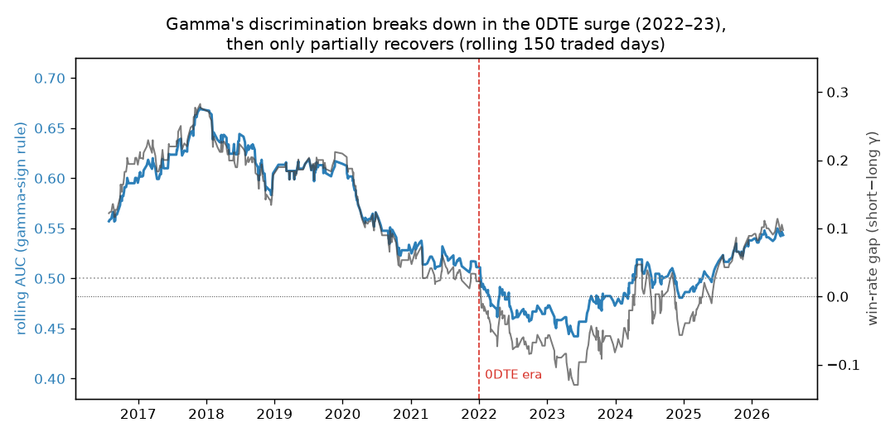
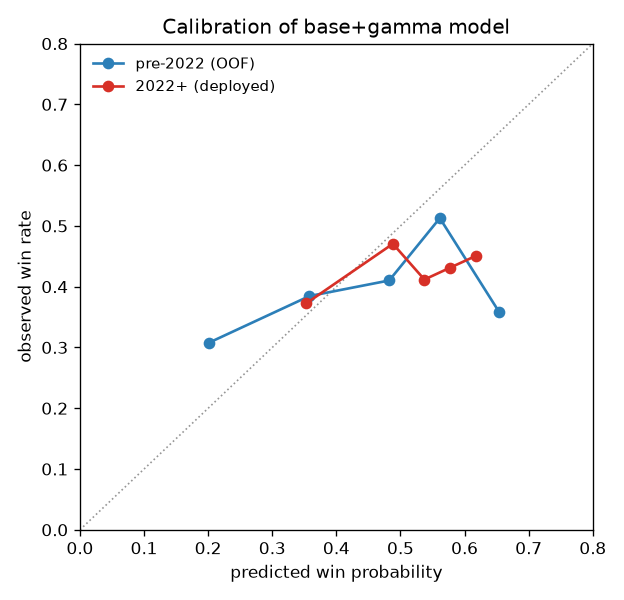
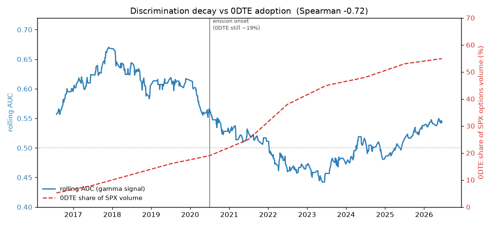
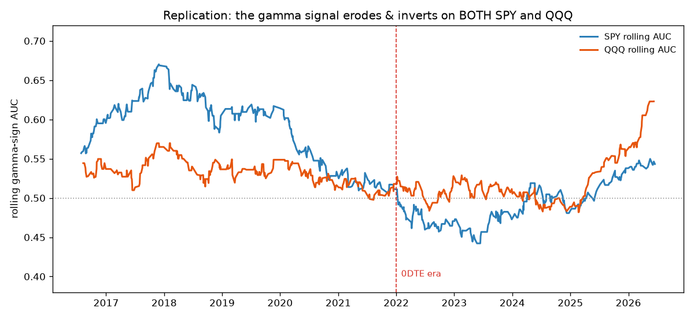

# Model-Reliability Monitor — Detecting & Diagnosing Distribution Shift

**TL;DR.** I built a small, model-agnostic system that watches a deployed model's discrimination
over time and raises a timestamped alarm when it drifts — then used it on a real market signal to
do an honest post-mortem. The signal (a dealer-gamma feature) predicted well through 2016–2019,
**eroded from ~2020, inverted below chance in 2022–23**, and partially recovered. The monitor would
have flagged it in **mid-2020, ~2 years early**. Tempting to blame the 2022 "0DTE" options boom —
the headline correlation is **−0.72** — but that story doesn't survive scrutiny, and saying so is
the point. The model is simple and the effect modest by design; the contribution is the *diagnosis*.

---

## 1. The question

Deployed models fail over time. The valuable skill is not another accuracy point on a static
split — it's **diagnosing why a model stops working**: overfitting, input drift, or a change in the
input→target relationship itself? This project turns that into (a) a reusable monitoring tool and
(b) an honest case study with a sharp, datable structural break to study (0DTE options after ~2022).

## 2. Setup

- **Data.** 19 years of 1-minute SPY bars (2007–2026) + a daily dealer-gamma feature (GEX) from
  options data. Gamma is *economically motivated, not data-mined*: dealer hedging amplifies trends
  when short gamma and mean-reverts when long gamma, so it's an ex-ante reason the strategy should
  pay on some days.
- **Target.** The strategy trades ~30% of days; among those **traded days** I predict **win vs.
  loss** (~700 days; 445 pre-2022, 255 after). Clean alpha question, no no-trade-zero pollution.
- **Leakage-free.** Every feature is lagged to the prior close; models only ever fit on data
  strictly before the day they score (expanding-window walk-forward).
- **Honest uncertainty.** Small, autocorrelated sample → AUC bands use a moving-block bootstrap.

## 3. The monitoring system

The core (`src/monitor.py`) is **model-agnostic**: feed it `(timestamp, score, label, features)`
and it returns rolling AUC (with bootstrap bands), calibration drift, per-feature signal decay, and
**CUSUM change-point alarms** on discrimination. A Streamlit dashboard (`app.py`) wraps it for any
model under test. Run on the gamma signal:



Healthy ≈0.60 through 2019; the detector fires **one early-warning alarm in mid-2020** as sustained
decline begins; AUC crosses below 0.5 in 2022 and troughs in 2023 (~0.44); partial recovery after.
The alarm is conservative (tuned to ignore the minor 2016/2020-noise dips and flag only sustained
degradation) and fires ~2 years before the trough — an *early warning*, not a post-mortem.

## 4. The drift, in detail: erosion → inversion → partial recovery

Splitting into the three regimes the rolling view implies:

| Regime | n | win \| short-γ | win \| long-γ | gap | γ-sign AUC |
|---|---:|---:|---:|---:|---:|
| pre-2022 (2014–21) | 445 | 0.43 | 0.31 | **+12pp** | 0.562 |
| 0DTE surge (2022–23) | 121 | 0.39 | 0.54 | **−15pp** | 0.476 |
| recent (2024–26) | 134 | 0.48 | 0.38 | **+11pp** | 0.548 |

Pre-2022 the edge is clean (short-gamma days win 12pp more); in 2022–23 it **inverts** (long-gamma
days win *more*); by 2024–26 the old +11pp edge re-emerges. Year-by-year (with honest small-sample
noise) and the rolling-AUC view tell the same story:




**The strategy itself did not get worse** — the short leg's win rate among traded days actually
*rose* (0.37 → 0.43). What broke is a *feature's ability to time it*: distribution shift, not a
dead strategy.

## 5. Localizing the drift to the feature

Mutual information between each feature and the target collapses **for the gamma feature** post-2022
(≈0.018 → ≈0) while base features don't show that pattern. And the deployed model's confident
predictions stop delivering — calibration flattens:



## 6. Attribution: does it track 0DTE? (the honest part)

Overlaying a real, Cboe-anchored 0DTE-share series on the monitor's discrimination:



The full-overlap correlation is a tempting **Spearman −0.72** — as 0DTE rose, discrimination fell.
But it must **not** be read as clean causation:

- **Onset precedes the surge.** Discrimination eroded from ~2020, when 0DTE was still ~19%.
- **Recovery contradicts it.** AUC rebounded 0.44 → 0.54 from 2024 *while 0DTE kept climbing to
  ~55%* — so within 2022+ the correlation actually **flips to +0.76**.

**Verdict: 0DTE coincides with the inversion phase but explains neither the 2020 onset nor the
2024+ recovery.** A single-cause story is not supportable; the data is messier than the −0.72
headline, and reporting that is the project's whole ethos.

## 7. Does it replicate? An independent test on QQQ

Running the identical monitor on QQQ's *own* gamma signal (its own GEX, its own win/loss labels):



| Regime | SPY gap / AUC | QQQ gap / AUC |
|---|---|---|
| pre-2022 (2014–21) | +0.12 / 0.562 | +0.05 / 0.528 |
| 0DTE surge (2022–23) | −0.15 / 0.476 | −0.06 / 0.490 |
| recent (2024–26) | +0.11 / 0.548 | +0.29 / 0.648 |

The same **erosion → inversion → recovery** shape appears independently on QQQ — the win-rate gap
has the same sign in all three regimes, and the two rolling-AUC curves move together from 2021 on.
So the phenomenon is **not a single-instrument fluke**. Honestly, though, it is **weaker and
noisier on QQQ**: the gamma edge was smaller to begin with (baseline AUC 0.53 vs SPY's 0.60), the
inversion is shallower (−0.06 vs −0.15), and the trough comes later. **Directionally replicated;
magnitude is instrument-specific.**

## 8. Ruling out the alternatives

- **Overfitting?** The pattern is consistent across three independent measures (win-rate gap, rule
  AUC, feature MI) and tied to an external event window — an overfit feature wouldn't invert exactly
  around a microstructure change and then partially revert.
- **Crowding?** A crowded edge fades monotonically toward zero; this *inverts then recovers*.
- **Easy-regime artifact?** The 2022–23 break was *more* volatile, so the opportunity was still
  there — the feature mismeasured it.

## 9. What this demonstrates

- A reusable **drift-detection / model-monitoring system** with timestamped alarms — production-ML.
- **Leakage-free temporal validation** + **honest uncertainty** (block-bootstrap) on a small sample.
- **Drift localization** (which feature, when) and **external-data attribution** that resists the
  easy causal story.
- **Restraint.** A modest, honestly-reported effect with a clear mechanism — not an inflated number.

**Limitations.** Single market, daily, ~few hundred days per regime; AUCs 0.5–0.6 with CIs brushing
0.5. The detector applies standard methods (rolling metrics + CUSUM); the contribution is the
evaluation and the honest diagnosis, not model complexity.

## 10. Reproduce

```bash
micromamba env create -f environment.yml
micromamba run -n intraday-momentum python scripts/build_dataset.py   # one-time ETL
micromamba run -n dist-shift-diagnosis python scripts/run_all.py      # numbers + figures
micromamba run -n dist-shift-diagnosis streamlit run app.py           # the dashboard
```
